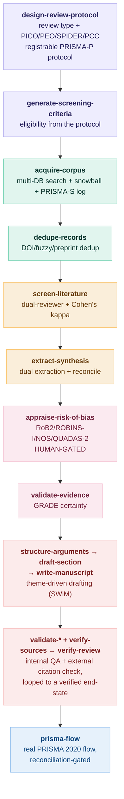

# agentic-research

**An AI-agent pipeline for literature & systematic reviews — aligned with PRISMA 2020, Cochrane, and GRADE, and honest about where a human stays in the loop.**

A suite of 24 composable [agent skills](#how-skills-work) that take a review from a *question* to a *defensible synthesis*: design a registrable protocol, search the literature, deduplicate, screen, extract, appraise risk of bias, grade certainty, draft, and verify every citation against the real bibliographic record — emitting a PRISMA flow diagram whose numbers actually reconcile.

Built to run with AI coding agents (Claude Code, and other harnesses that load Markdown skills). **Keyless by default** — the runnable backends use free APIs (OpenAlex, CrossRef) and the Python standard library; a paid literature API (scite) is optional enrichment, never required.

---

## Why this exists

LLM-assisted reviews fail in predictable, documented ways:

- **Fabricated citations** — LLMs invent or corrupt references at rates reported from 14% to over 90%.
- **No real search** — "here are some PDFs I had" is not a reproducible, multi-database search.
- **Single-pass everything** — screening, extraction, and appraisal done once, by one rater, with no agreement check.
- **Hollow reporting** — a PRISMA flow diagram whose numbers came from nowhere.
- **No disclosure** — substantive AI assistance unrecorded, when journals now require it (PRISMA-trAIce, ICMJE).

This pipeline answers each of those with a methodology stage, a runnable check, and — where the evidence says LLMs are weak (risk-of-bias appraisal, numeric verification) — a deliberate **human gate** rather than automation.

## The pipeline



`orchestrate-research` routes the whole thing; `synthesize-research` and `review-literature` are pre-built end-to-end pipelines for common cases.

## What's in it

| Stage | Skills |
|:------|:-------|
| **Protocol & question** | `design-review-protocol`, `generate-screening-criteria` |
| **Search & acquisition** | `acquire-corpus`, `dedupe-records` |
| **Screening** | `screen-literature` (single or dual-reviewer + κ) |
| **Extraction & synthesis** | `extract-synthesis`, `synthesize-research`, `recursive-lit-review`, `structure-arguments` |
| **Appraisal & grading** | `appraise-risk-of-bias` (human-gated), `validate-evidence` (GRADE) |
| **Drafting** | `draft-section`, `write-manuscript`, `frame-contributions`, `enhance-writing`, `tools-for-thought` |
| **Validation** | `verify-sources` (external), `validate-citations` (internal), `validate-consistency`, `validate-manuscript` (single-pass batch), `verify-review` (loop to a verified end-state) |
| **Reporting** | `prisma-flow` |
| **Orchestration** | `orchestrate-research`, `review-literature` |

Plus the `steering/ai-research-provenance.md` convention (per-decision model/prompt stamping + a mandatory AI-disclosure artifact).

## Runnable backends (no API key)

Several skills ship a standard-library Python script so they *run*, not just describe:

| Script | Skill | Does |
|:-------|:------|:-----|
| `search_openalex.py` | acquire-corpus | OpenAlex search + backward/forward snowballing |
| `dedupe_records.py` | dedupe-records | DOI-exact + fuzzy-title + preprint reconciliation |
| `kappa.py` | screen-literature | Cohen's κ + recall/MCC vs reference + disagreements |
| `prisma_flow.py` | prisma-flow | PRISMA 2020 flow (Mermaid) + arithmetic reconciliation |
| `resolve_citation.py` | verify-sources | DOI resolution + retraction check (OpenAlex/CrossRef) |
| `review_units.py` | verify-review | Units-remaining scalar + the VERIFIED/CONTINUE verdict (fails closed) |
| `grade_profile.py` | validate-evidence | GRADE completeness + certainty arithmetic → evidence profile & summary of findings |
| `rob_appraisal.py` | appraise-risk-of-bias | Instrument/design match + domain completeness → traffic-light summary, `H_rob` count |
| `prisma_checklist.py` | prisma-flow | PRISMA 2020 reporting completeness over 42 rows → completed checklist |
| `rlm_corpus_loader.py` | review-literature | Builds a JSONL corpus from Markdown/PDF files. **Markdown is stdlib-only; PDF text extraction needs `pypdf` or `PyPDF2`** — the one optional dependency in the repository, imported lazily and failing with an actionable message |

```bash
# e.g. confirm a citation is real and not retracted — no key needed:
python skills/verify-sources/scripts/resolve_citation.py "10.1016/S0140-6736(97)11096-0"
# -> ⛔ RETRACTED
```

## Design principles

- **Keyless baseline, paid APIs optional.** Everything works on free OpenAlex/CrossRef + stdlib. The scite MCP (paid) adds Smart-Citation fidelity when present; the skills detect its absence and degrade gracefully, never block.
- **Humans where LLMs are weak.** Extraction and search lean on automation (LLM extraction accuracy ~0.95). Risk-of-bias appraisal (~0.62) and numeric verification require human confirmation — by design, not omission.
- **Every stage auditable.** Real search logs (PRISMA-S), a real duplicates-removed count, real screening agreement (κ), real exclusion reasons — feeding a PRISMA flow that *fails the build if the numbers don't reconcile*.
- **Standards, not vibes.** See the alignment table below.

## Standards alignment

**Enforced** means a runnable check fails when the standard is violated. **Guidance** means the
methodology is documented and followed by the agent, but nothing verifies the result. Both are
legitimate; conflating them is not, so the distinction is stated rather than left to inference.

| Standard | Where | Enforced? |
|:---------|:------|:----------|
| **PRISMA 2020** — flow diagram | `prisma-flow` → `prisma_flow.py` | ✅ arithmetic reconciliation, exit 1 under `--strict`; closed schema with a required `schema_version`, exit 2 |
| **PRISMA 2020** — checklist | `prisma-flow` → `prisma_checklist.py` | ✅ completeness over all **42 addressable rows** (27 numbered items + lettered sub-items) |
| **PRISMA-S** (search reporting) | `acquire-corpus` search log | ⚠️ guidance — the log is written, not validated |
| **PRISMA-ScR** (scoping) | `design-review-protocol` review-type branch | ⚠️ guidance — and the checklist variant is **deliberately not implemented**: its item table could not be transcribed from an accessible copy of the source, and an approximated table would make every verdict wrong while looking authoritative, so `prisma_checklist.py` refuses the variant rather than guessing |
| **Cochrane / JBI** — dual screening | `screen-literature` → `kappa.py` | ✅ κ computed; `--min-kappa` fails below the floor |
| **Cochrane / JBI** — dual extraction, protocol | `extract-synthesis`, `design-review-protocol` | ⚠️ guidance — no agreement metric |
| **GRADE** (certainty) | `validate-evidence` → `grade_profile.py` | ✅ all five domains present, whole-step ratings, starting level vs predominant design, certainty arithmetic, upgrade legality; cross-result aggregates rejected outright |
| **RoB 2 / ROBINS-I / Newcastle-Ottawa / QUADAS-2** | `appraise-risk-of-bias` → `rob_appraisal.py` | ✅ instrument matches design, all domains present and in-vocabulary, overall vs worst domain; **human confirmation is checked for presence, never authenticity** |
| **SWiM** (non-meta-analysis synthesis) | synthesis skills | ⚠️ guidance |
| **PRISMA-trAIce / ICMJE** (AI disclosure) | `steering/ai-research-provenance.md` | ⚠️ guidance |
| **PROSPERO / OSF** (registration) | `design-review-protocol` | ⚠️ guidance — produces content to submit; registration is yours |
| **Verification loop** | `verify-review` → `review_units.py` | ✅ fails closed; cannot report VERIFIED on a partial units map |

Closing the ⚠️ rows for GRADE, risk-of-bias and the reporting checklist is the subject of
[specs/001-standards-enforcement-parity](specs/001-standards-enforcement-parity/spec.md).

## How skills work

Each skill is a directory with a `SKILL.md` (agent instructions), a `README.md` (human docs), and optional `scripts/` and `references/`. An AI agent reads the skill's frontmatter to know *when* to use it and the body for *how*. See [INSTALL.md](INSTALL.md) to wire `skills/` into your agent.

## Install & use

See **[INSTALL.md](INSTALL.md)**. In short: point your agent at `skills/`, then ask in natural language — *"design a protocol for a review of X"*, *"build a corpus for X"*, *"screen these against my criteria with two reviewers"*, *"verify the citations in this draft"*. The agent picks the right skill.

## Scope & honesty

- This is a **narrative / qualitative-synthesis** pipeline that follows SWiM. It does **not** do meta-analysis (pooled effect sizes, forest plots) — that's a deliberate scope choice; use a meta-analysis tool for quantitative pooling.
- A PASS from `verify-sources` means citations are real, current, and not obviously misrepresented — **not** that the argument is correct.
- The human gate on appraisal is real: an appraisal with unconfirmed machine ratings is not a completed appraisal.

## License

MIT — see [LICENSE](LICENSE). Built with AI.
